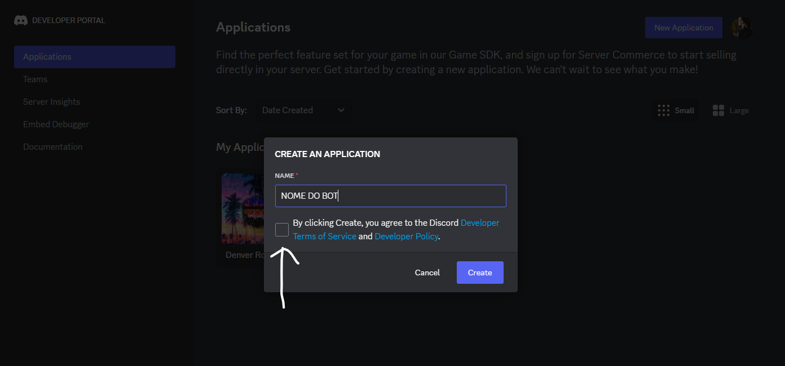
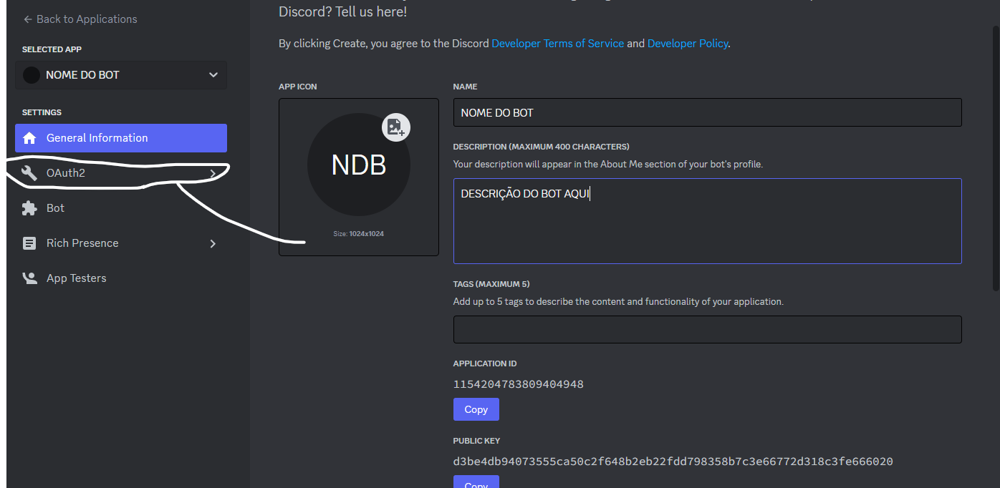

### Olá, eu me chamo Adrian, e nessa extensa explicação iremos aprender a criar um bot para o discord e utilizar-lo na sua gamemode pawn,usando a própria linguagem pawn para programar-lo.

# INDICE:

## |PARTE 1-CRIANDO O BOT|

## |PARTE 2-CONECTANDO ELE COM A GAMEMODE|

## |PARTE 3-DEIXANDO ELE ONLINE|

## INFO:Caso você queira ver esse tutorial em formato de video aula,acesse este link:(EM BREVE)

# PARTE 1-CRIANDO O BOT

-Primeiramente acesse o site: https://discord.com/login?redirect_to=%2Fdevelopers

-No canto direito da tela clique para logar sua conta do discord,bote seu email e senha,lembrando que esse site é seguro, pois ele é do próprio discord.

-Agora aperte na opção "Aplications" 

e logo após na opção "New Aplication"

na caixa de texto digite o nome do seu bot, marque a caixinha selecionável e logo após aperte em "Create".

-Agora vai mostrar todas as informações do seu bot, na opção "App Icon" selecione uma foto da galeria para ser a foto do bot:

 e na caixa descrição,caso queira adicionar uma descrição para ele.

-Após tudo isso acima, aperte no botão "OAuth2":

logo após no botão "URL Generator", Você vai ver a palavra Scops e um monte de caixas selecionáveis, aperte na caixa que diz "bot", 

logo após que você apertar vai aparecer uma palavra escrita "BOT PERMISSIONS" e novamente várias caixinhas, você marca a caixa que diz "Administrador".

-Após isso,vá para baixo e vai ter uma caixa com um link e em cima dela escrito "Generated Url", copie esse link e cole em uma aba nova na caixa de url, esse link serve para convidar o bot para seu discord.

 após adicionar o bot no seu discord volte para o site developer e aperte no botão "Bot":
 
 
aperte em icon e bote novamente a foto do seu bot e escreva novamente o nome dele.

-Após seguir todos os passos acima,o seu bot não estará online AINDA,mas já estara funcionando no seu discord.

# PARTE 2-CONECTANDO ELE COM A GAMEMODE

Na própria opção Bot onde estamos, desça para baixo e marque as seguintes caixas:

E desça mais um pouco para baixo e marque a opção administrador:

Agora volte para o topo e aperte na opção reset token bot:

Aperte em Yes, do it:

Assim que apertar irá aparecer o token do seu bot:

# OBS: NÃO COMPATLHE O TOKEN DO SEU BOT COM NINGUÉM, POIS COM O TOKEN É POSSIVEL DESTRUIR O DISCORD QUE ELE ESTÁ HOSPEDADO

Copie o Token e cole no server.cfg da sua gamemode usando o seguinte modelo:

discord_bot_token TokenDoBotAqui

Exemplo: 

Pronto!Seu bot já está conectado com a gamemode, mas ainda não está online, isso virá na parte 3!

# PARTE 3-Em breve