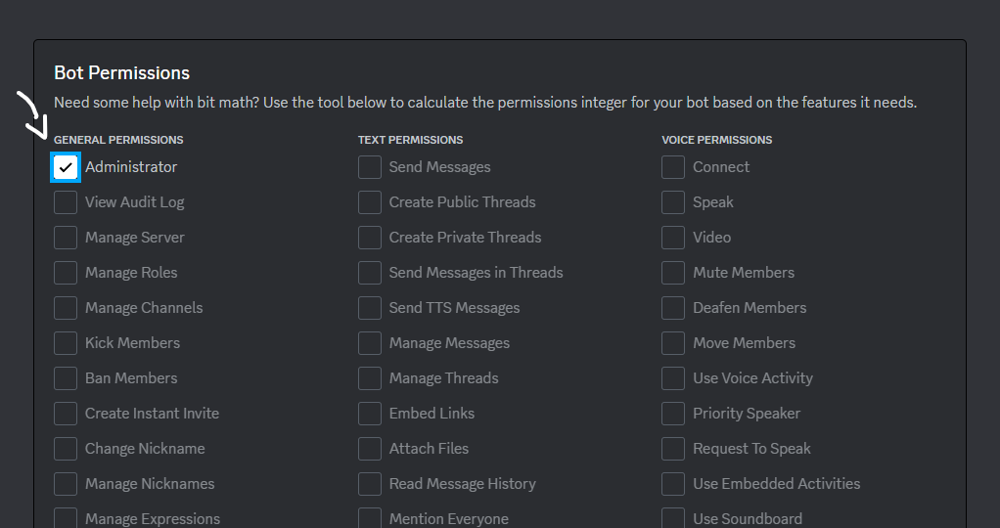

### Olá, eu me chamo Adrian, e nessa extensa explicação iremos aprender a criar um bot para o discord e utilizar-lo na sua gamemode pawn,usando a própria linguagem pawn para programar-lo.

# INDICE:

## |PARTE 1-CRIANDO O BOT|

## |PARTE 2-CONECTANDO ELE COM A GAMEMODE|

## |PARTE 3-DEIXANDO ELE ONLINE|

## INFO:Caso você queira ver esse tutorial em formato de video aula,acesse este link:(EM BREVE)

# PARTE 1-CRIANDO O BOT

-Primeiramente acesse o site: https://discord.com/login?redirect_to=%2Fdevelopers

-No canto direito da tela clique para logar sua conta do discord,bote seu email e senha,lembrando que esse site é seguro, pois ele é do próprio discord.

-Agora aperte na opção "Aplications" 


e logo após na opção "New Aplication"


na caixa de texto digite o nome do seu bot, marque a caixinha selecionável e logo após aperte em "Create".


-Agora vai mostrar todas as informações do seu bot, na opção "App Icon" selecione uma foto da galeria para ser a foto do bot:


 e na caixa descrição,caso queira adicionar uma descrição para ele.


-Após tudo isso acima, aperte no botão "OAuth2":


logo após no botão "URL Generator", Você vai ver a palavra Scops e um monte de caixas selecionáveis, aperte na caixa que diz "bot", 


logo após que você apertar vai aparecer uma palavra escrita "BOT PERMISSIONS" e novamente várias caixinhas, você marca a caixa que diz "Administrador".


-Após isso,vá para baixo e vai ter uma caixa com um link e em cima dela escrito "Generated Url", copie esse link e cole em uma aba nova na caixa de url, esse link serve para convidar o bot para seu discord.


 após adicionar o bot no seu discord volte para o site developer e aperte no botão "Bot":
 
 
aperte em icon e bote novamente a foto do seu bot e escreva novamente o nome dele.


-Após seguir todos os passos acima,o seu bot não estará online AINDA,mas já estara funcionando no seu discord.

# PARTE 2-CONECTANDO ELE COM A GAMEMODE

Na própria opção Bot onde estamos, desça para baixo e marque as seguintes caixas:


E desça mais um pouco para baixo e marque a opção administrador:



Agora volte para o topo e aperte na opção reset token bot:


Aperte em Yes, do it:


Assim que apertar irá aparecer o token do seu bot:


# OBS: NÃO COMPATLHE O TOKEN DO SEU BOT COM NINGUÉM, POIS COM O TOKEN É POSSIVEL DESTRUIR O DISCORD QUE ELE ESTÁ HOSPEDADO

Copie o Token e cole no server.cfg da sua gamemode usando o seguinte modelo:

discord_bot_token TokenDoBotAqui

Exemplo: 


Pronto!Seu bot já está conectado com a gamemode, mas ainda não está online, isso virá na parte 3!

# PARTE 3-DEIXANDO ELE ONLINE

Bom, para deixar o bot online baixe a include discord-connector e a include discord-cmd, links:

include discord-connector: https://www.mediafire.com/file/jft2mrvtax6ejo8/discord-connector.inc/file

include discord-cmd: https://www.mediafire.com/file/scshva6icsxzmmh/discord-cmd.inc/file

Após baixar as 2 includes acima abra a pasta pawno da sua gamemode:


e abra a pasta include:


Coloque os dois arquivos baixado dentro dela:


Logo após baixa os dois plugins:

plugin discord-connector.so: https://www.mediafire.com/file/i6n3jv3coxethp0/discord-connector.so/file

plugin discord-connector.dll: https://www.mediafire.com/file/d1f0f1zhna6e8ct/discord-connector.dll/file

Após baixar coloque os dois dentro da pasta plugins que fica dentro da gamemode:


Logo após isso baixe as log-cores:

log-core2.dll: https://www.mediafire.com/file/ow85fyfyq43e8y6/log-core2.dll/file

log-core2.so: https://www.mediafire.com/file/aua58i4l2s5872j/log-core2.so/file

Coloque elas dentro da gamemode(FORA DE PASTAS):


Agora aba sua gamemode e defina as includes discord-cmd e discord-connector:

```pawn
#include <discord-cmd>
#include <discord-connector> 
´´´
